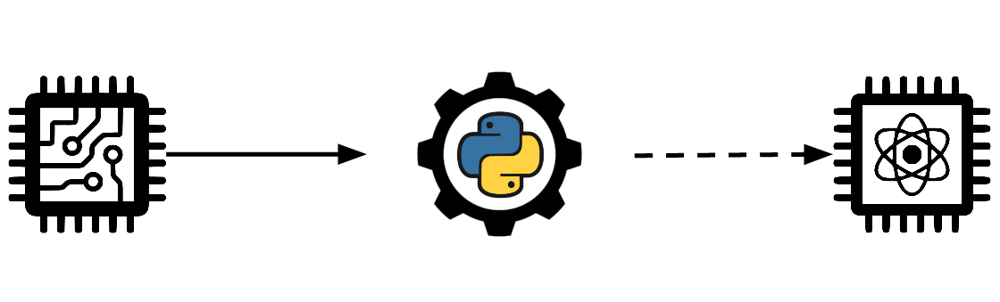

# Logi<span style="color:red">q</span>, a _simple_ quantum logic simulator



---
Logi<span style="color:red">q</span> is a python library to simulate the ***logic* of the quantum world**, and not only the computation aspects.

## Main aspects
This library aims to make easy and simple the using of the quantum states (i.e. qubits and something more 😉), operator, basis and mostly, how these interacts with each other.

To achieve this, the library is focused to add a **great layer of  abstraction** to gain simplicity and in comprehensibility.

This layer includes:
- Great support for the bra-ket notation to represent the states.
- Treatment of _quantum states_ in a more general point of view, this means mainly that:
    - "**qudit**" (**qu**antum **d**-g**it**) state are supported
    - Every kind of state have same methods and same behaviour (easy to use!)
- Custom creation of bases and operators
- The elimination of the _registers_ concept, so **every quantum state have a life of its own** and they aren't bind to a position in the registers.


## Start with logi<span style="color:red">q</span>
To start I suggest you to read first of all an introduction to the main objects of logiq:
- [Ways to create a quantum state](docs/Quantum_state_creations.md)
- [Bases](docs/Bases.md)
- [Operators](docs/Operators.md)

Then you can easily read [this](docs/Uses_of_logiq.md) (a friendly introduction in the use of logiq)

If you want more go [here](docs/Examples/Examples_list.md), you can find some example, explanation of quantum phenomena (using logiq), implementation of most known algorithms and more.

---
## Installation

Logiq is written for `python3` (the minimum version tested is 3.6.8) and the only package required is `numpy`.

You can easily install it using **pip**: (suggested way)
```
$ pip install -U logiq
```

Or cloning this repository and manually install it:
```
$ git clone git@github.com:Bnz-0/logiq.git
$ pip install -U ./logiq
```

---

## Contacts
- Email: [matteo.benzi97@gmail.com](mailto:matteo.benzi97@gmail.com)
- Telegram: [@bnz997](https://t.me/bnz997)

Do not hesitate to contact me for anything 😉