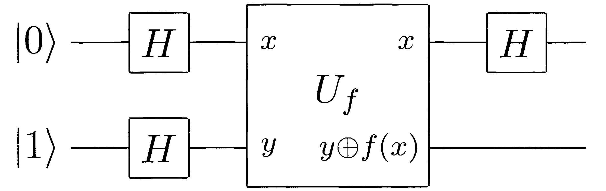

# Deutsch–Jozsa algorithm

> [If you want to know what I'm talking about](https://en.wikipedia.org/wiki/Deutsch%E2%80%93Jozsa_algorithm)

Here the scheme of the algorithm:



The following implementation can be interesting because it **generate the `Uf` operator dynamically using `f(x)`**


The operator `Uf` can be generate following this scheme:

|State||f(0)=f(1)=0|f(0)=f(1)=1|f(0)=0,f(1)=1|f(0)=1,f(1)=0|
|---|---|---|---|---|---|
|&#124;00>| -> |&#124;00>|&#124;01>|&#124;00>|&#124;01>|
|&#124;01>| -> |&#124;01>|&#124;10>|&#124;01>|&#124;00>|
|&#124;10>| -> |&#124;10>|&#124;11>|&#124;11>|&#124;10>|
|&#124;11>| -> |&#124;11>|&#124;10>|&#124;10>|&#124;11>|

```python
from logiq import qbit, Op

# define the f(x)
f = lambda x: 0 # for instance a constant function

# generate the Uf operator (dynamically!)
Uf = Op.build({
    0: 0^f(0),
    1: 1^f(0),
    2: 2+0^f(1),
    3: 2+1^f(1)
})

# create the 2 initial qubits
q = qbit('|0>') @ qbit('|1>')

Op.H ^ q # (this apply to all qubits the H gate)
Uf | q
Op.H | q[0]

q[0].measure()
print(q[0])
#if q[0] is |0> then f(x) is constant, else is balanced
```